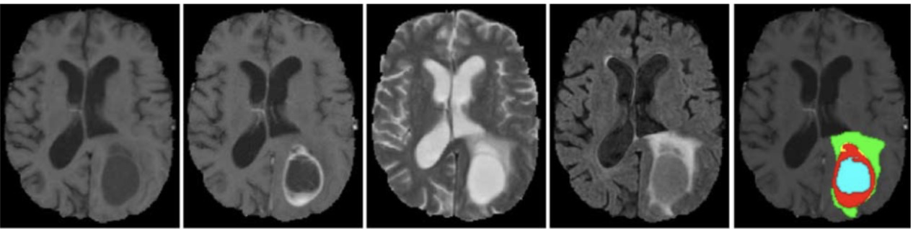
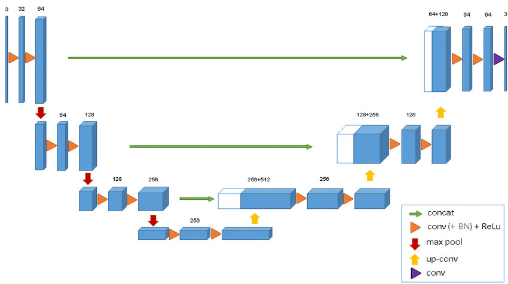
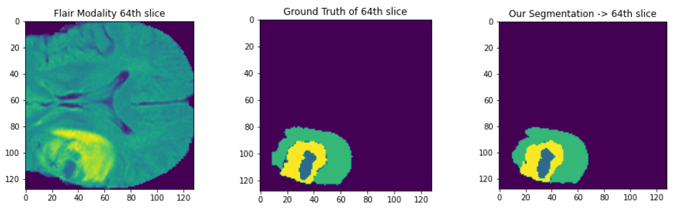
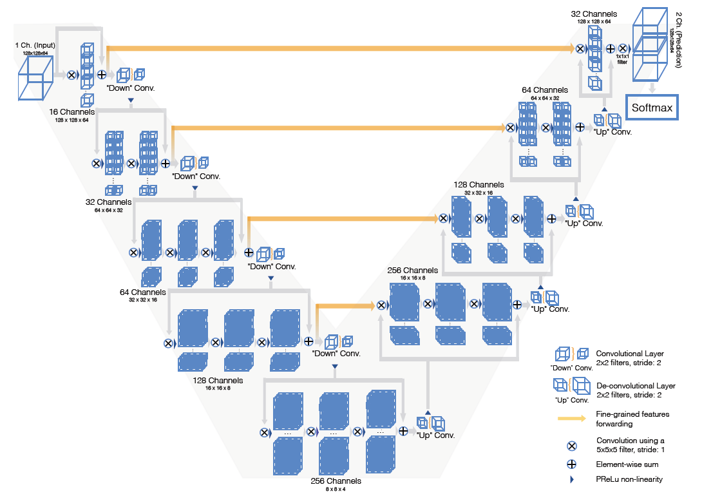
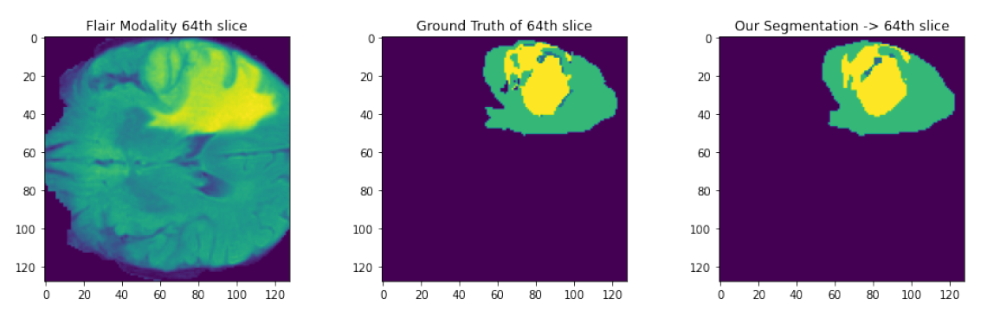
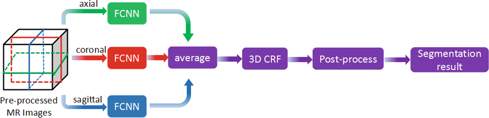
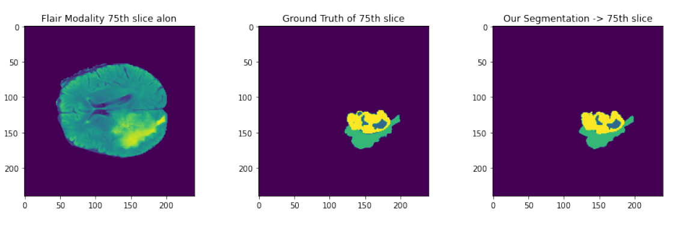
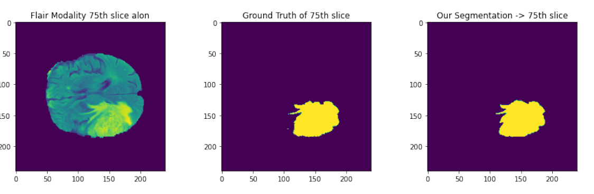
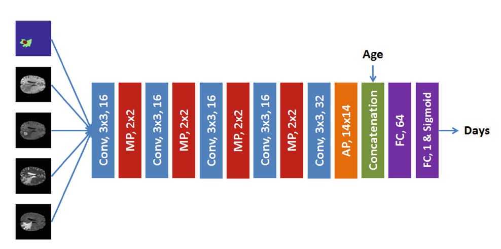

# Brain-Tumor-Segmentation-and-Survival-Prediction-using-Deep-Neural-Networks

Keras implementation. Complete Report Link : https://www.cse.iitb.ac.in/~shalabhgupta/Report.pdf

## Dataset
BraTS 2017 and 2018 data can be found on Kaggle.

## Using the code
Have a look at the LICENSE.

## Resources
As such, this code is not an implementation of a particular paper,and is combined of many architectures and deep learning techniques from various research papers on Brain Tumor Segmentation and survival prediction. Some of the best resources used are mentioned below.

- https://arxiv.org/pdf/1505.03540.pdf : Patch based Brain Tumor Segmentation
- https://www.biorxiv.org/content/10.1101/760157v1.full.pdf : Encoder Decoder network with dice loss
- https://arxiv.org/pdf/1802.10508v1.pdf : Unet 3D
- https://arxiv.org/abs/1606.04797 : VNet 3D
- https://arxiv.org/pdf/1903.11593.pdf : Survival Prediction Idea of extracting features
- https://link.springer.com/chapter/10.1007/978-3-319-75238-9_17 : Integrating results along the 3 axis and different models
- https://link.springer.com/chapter/10.1007/978-3-319-75238-9_30: Inception U-Net
- https://link.springer.com/chapter/10.1007/978-3-319-75238-9_15 : Pooling free DenseNet architecture

## Task
Task is of segmenting various parts of brain i.e. labeling all pixels in the multi-modal MRI images as one of the following classes:
- Necrosis
- Edema
- Non-enhancing tumor
- Enhancing tumor 
- Everything else

Brats 2015 dataset composed of labels 0,1,2,3,4 while Brats 2017 dataset consists of only 0,1,2,4.

## BRATS Dataset 
I have used BRATS 2017 training dataset for the analysis of the proposed methodology. It consists of real patient images as well as synthetic images created by MICCAI. Each of these folders are then subdivided into High Grade and Low Grade images. For each patient, four modalities(T1, T1-C, T2 and FLAIR) are provided. The fifth image has ground truth labels for each pixel. The dimensions of images are (240,240,155) in both.

## Dataset pre-processing 
Model has been trained on only those slices having all 4 labels(0,1,2,4) to tackle class imbalance and label 4 has been converted into label 3 (so that finally the one-hot encoding has size 4).

## Model Architecture and Results
### 3D U-Net Architecture :

#### We achieved a dice score of 0.74 with this architecture.
#### This is our second best model.

### Results

### 3D V-Net Architecture

#### We achieved a dice score of 0.68 with this.

### Results 

### Combining along the 3 views(2D axes integration)
Inspired by https://link.springer.com/chapter/10.1007/978-3-319-75238-9_17, I created different UNet models for axial,sagittal and coronal 2D views of the 3D modality and trained on each of them and then the 3 models were combined to predict labels for each image. The combination can be performed using average of probabilities predicted by the 3 models for the 4 classes on each pixel.Then the final prediction is made using argmax function.

#### We achieved a dice score of 0.756 with this model for 4 class segmentation(Segmenting all the parts of tumor).

#### We achieved a dice score of 0.937 with this model for 2 class segmentation(Segmenting only whole tumor and non tumor parts of brain)

### Survival Prediction Model
Various methods have been tried for survival prediction of patients based on their MRI images.
Inspired from https://link.springer.com/chapter/10.1007/978-3-319-75238-9_13 , our architecture comprises of convolutional blocks that extract survival related features from the MRI images concatenated with their corresponding segmented image(as a channel map), concatenates age of the patient with these feature maps and finally Fully Connected layers are applied. The model classifies the patients to be lying in one of the 3 categories according to their survival days.

We achieved a testing accuracy of 51.07% while most of the SOTA techniques have about 55-57%. 

### Note : All images have been taken from the mentioned papers.

